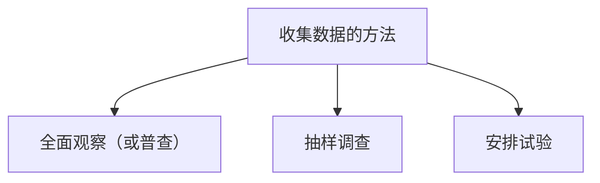

## 教学目的：

1. 使学生对什么叫数理统计及其发展史有一个初步的了解。
2. 使学生掌握数理统计的若干基本概念，如总体、样本、简单样本、统计模型等。
3. 使学生掌握统计量 $\chi^{2}$ 、t、 $F$ 、正态总体样本均值和样本方差的分布及其简单性质

## 引言

### 什么叫数理统计学

数理统计是数学的一个分支，它是研究如何有效地**收集和使用**带有随机性影响的**数据**的一门学科

**1.有效地收集数据**

例 4.1.1. 人口普查和抽样调查．我国在 2000 年进行了第五次人口普查，如果普查的数据是准确无误的，无随机性可言，不需用数理统计方法。由于人口普查工作量极大，而训练有素的工作人员缺乏，因此虽是全面调查，但数据并不可靠（农村超计划生育瞒报、漏报人口的情况时有发生）. 针对普查数据不可靠，国家统计局在人口普查的同时还派出专业人员对全国人口进行抽样调查，**根据抽样调查的结果，对人口普查的数字进行适当的修正. 抽样调查在普查不可靠时是一种补充办法**.

> 如何安排抽样调查，这是有效收集数据的重要问题，这构成数理统计学的一个重要分支——《抽样调查方法》

例 4.1.2. 考察某地区 10000 农户的经济状况. 从中挑选 100 户做抽样调查. 若该地区分成平原和山区两部分，平原地区较富，占该地区农户的 $70\%$ ，山区的 $30\%$ 农户较穷．我们的抽样方案规定在抽取的 100 户中，从平原地区抽 70 户，山区抽 30 户，在各自范围内用随机化方法抽取.

在本例中有效收集数据是通过合理地设计抽样方案来实现的，在通过试验收集数据的情形如何做到有效收集数据，请看下例：

例 4.1.3. 某化工产品的得率与温度、压力和原料配方有关. 为提高得率，通过试验寻找最佳生产条件. 试验因素和水平如下

3 个因素，每个因素 4 个水平共要做 $4^3=64$ 次试验[^1]. 做这么多试验人力、物力、财力都不可能，因此，如何通过尽可能少的试验获得尽可能多的信息？比如采用**正交表安排试验**就是一种有效的方法

如何安排试验方案和分析试验结果. 这构成数理统计的另一分支——《试验的设计和分析》. 在本例中有效收集数据是通过科学安排试验的方法来实现的

在有效收集数据中一个重要问题是：数据必须具有随机性

**2.有效的使用数据**

获取数据后，需要用有效的方法，去**集中和提取**数据中的有关信息，以对所研究的问题作出一定的**结论**. 在统计上称为**推断**

为了有效的使用数据进行统计推断，需要对数据建立一个统计模型，并给定某些准则去评判不同统计推断方法的优劣.

例 4.1.4. 为估计一个物体的重量 $a$ 把它在天平上称 5 次获得数据 $x_1,x_2,\cdots,x_5$, 它们都受到随机性因素的影响（天平的精度反映了影响的大小）. 估计 $a$ 的大小有下列三种不同方法：

(1) 用 5 个数的算术平均值 $\bar{x}=\frac{1}{5}(x_1+\cdots+x_5)$ 去估计 a;

(2) 将 $x_1,x_2,\cdots,x_5$ 按大小排列为 $x_{(1)}\leq x_{(2)}\leq\cdots\leq x_{(5)}$ ，取中间一个值 $x_{(3)}$ 去估计 a;

(3) 用 $W=\frac{1}{2}(x_{(1)}+x_{(5)})$ 去估计 a.

你可能认为 $\bar{x}$ 优于 $x_{(3)}$ ，而 $x_{(3)}$ 优于 $W.$ 这是不是对的？为什么是这样？在什么条件下才对？事实上，对这些问题的研究正是数理统计学的任务

要回答这些问题我们需要**对数据建立一个统计模型和制定评判不同统计推断方法的准则**. 本例中在适当的假定下，可认为数据服从正态模型 (那应该选择那种估计方法更合适？平均值>中位数>极值)

下面我们举一个例子说明采用合适的统计方法也是有效使用数据的一个重要方面

例 4.1.5. 某农村有 100 户农户，要调查此村农民是否脱贫．脱贫的标准是每户年均收入超过 1 万元. 经调查此村 90 户农户年收入 5000 元，10 户农户年收入 10 万元，问此村农民是否脱贫？

(1）用算术平均值计算该村农户年均收入如下：

$$
\bar{x}=(90\times0.5+10\times10)/100=1.45(\text{万})
$$

按此方法得出结论：该村农民已脱贫. 但 90% 的农户年均收入只有 5000 元，事实上并未脱贫

(2）用样本中位数计算该村农户年均收入：即将 100 户的年收入记为 $x_1,x_2,\cdots,x_{100}$, 将其按大小排列为 $x_{(1)}\leq x_{(2)}\leq\cdots\leq x_{(100)}$ .样本中位数定义为排在最中间两户的平均值，即

$$
(x_{(50)}+x_{(51)})/2=0.5(\text{万})
$$

按此方法得出结论：该村农民尚未脱贫. 这与实际情况相符

**3.数理统计方法的归纳性质**

数理统计是数学的一个分支，但是它的推理方法是不一样的.

**统计方法的本质是归纳式的，而数学则是演绎式的**。在几何学中要证明“等腰三角形两底角相等”，只需从等腰这个前提出发. 运用几何公理，一步步地推出这个结论（这一方法属于演绎推理）．而一个习惯于统计方法的人就可能想出这样的方法：作很多大小形状不一的等腰三角形，实际测量它的底角查看区别如何，根据所得数据，看看可否作出底角相等的结论，这属于归纳推理的方法

**归纳推理是要冒风险的**．事实上归纳推理的不确定性的出现，是一种逻辑的必然．人们不可能做出十分肯定的结论，因为归纳推理所依据的数据具有随机性，推理的不确定性程度是可以计算的，统计学的作用之一就是提供归纳推理和计算不确定性程度的方法. 不确定性是用概率计算的. 以后会见到我们求参数的区间估计，不但给出区间估计的表达式，而且给出这一估计区间包含未知参数的可靠程度的大小

## 数理统计的若干基本概念

### 总体和样本

> **总体、个体、样本**、样本的大小 (样本容量)、抽样

例 4.2.1. 假定一批产品有 10000 件，其中有正品也有废品，为估计废品率，我们往往从中抽取一部分，如 100 件进行检查．**此时这批 10000 件产品称为总体，其中的每件产品称为个体，而从中抽取的 100 件产品称为样本. 样本中个体的数目称为样本的大小，也称为样本容量. 而抽取样本的行为称为抽样**

**总体**：总体是与我们所研究的问题有关的所有个体组成，而样本是总体中抽取的一部分个体.

若总体中个体的数目为有限个，则称为**有限总体**，否则称为**无限总体**

在统计研究中，人们所关心的不是总体内个体的本身，而是关心个体上的一项（或几项) 数量指标，如日光灯的寿命，零件的尺寸. 在例 4.2.1 中若产品为正品用 0 表示，废品用 1 表示，我们关心的个体取值是 0 还是 1. 因此我又可获得总体的如下定义

总体可以看成有所有个体上的某种**数量指标**构成的集合，因此它是**数**的集合.

由于每个个体的出现是随机的，所以相应的个体上的数量指标的出现也带有随机性. 从而可以把此种数量指标看成随机变量，随机变量的分布就是该数量指标在总体中的分布，以例 4.2.1 来说明，假定 10000 只产品中废品数为 100 件，其余的为正品，废品率为 0.01. 我们定义随机变量 X 如下：

$$
X=\begin{cases}&1&\text{废品}\\&0&\text{正品,}\end{cases}
$$

其概率分布为 0-1 分布，且有 $P ( X$ = 1) = 0.01. 因此. 特定个体上的数量指标是随机变量 X 的观察值. 这样一来，总体可以用一个随机变量 $X$ 及其分布来描述，获得如下定义

> [!note] 定义 4.2.1.
> 一个统计问题所研究的对象的全体称为总体. 在数理统计学中总体可以用一个随机变量及其概率分布来描述

由于总体的特征由其分布来刻画，因此统计学上常把总体和总体分布视为同义语。有时也根据总体分布的类型来称呼总体的名称，如正态总体、二项分布总体、0-1 分布总体.

若总体分布函数记为 $F.$ 当有一个从该总体中抽取的相互独立同分布 (i.i.d.) 的大小为 n 的样本 $X_{1},\cdots, X_{n}$ 则常记为

$$
X_1,\cdots,X_n \quad\mathrm{i.i.d.}\:\sim F \tag{4.2.1}
$$

若 $F$ 有密度 $f$.可记为

$$
X_1,\cdots,X_n \quad\mathrm{i.i.d.}\:\sim f \tag{4.2.2}
$$

\* 若所考虑的总体用随机变量 $X$ 表示其分布函数为 F 则样本 $X_{1},\cdots, X_{n}$ 可视为随机变量 $X$ 的观察值，亦可记为

$$
X_1,\cdots,X_n \quad\mathrm{i.i.d.}\:\sim X \tag{4.2.3}
$$

(4.2.1)、(4.2.1) 和 (4.2.3) 表示相同的意思

当个体上的数量指标不止一项时，我们用随机向量来表示总体. 例如研究某地区小学生的发育状况时，人们关心的是其身高 X 和体重 Y 这两个数量指标，此时总体就可以用二维随机向量 $(X, Y)$ 或其联合分布 $F (x, y)$ 表示

### 样本的两重性和简单随机样本

**1、样本的两重性**

当我们从总体中作具体抽样时，每次抽样的结果都是些具体的数。以打靶问题为例，3 维样本 $X=(X_{1}, X_{2}, X_{3})$ .其中 $0\leq X_{i}\leq10$ 为整数, 它是数字向量. 但若是在相同条件下，再打三发，由于种种不可控制的随机因素的影响，中靶的环数不可能和上一次完全一样，具有随机性. 如果无穷次打下去，每次打三发，出现的结果可视为随机向量 $(X_{1}, X_{2}, X_{3})$ 的观察值

**样本的两重性是说，样本既可看成具体的数，又可以看成随机变量（或随机向量）**. 在完成抽样后，它是具体的数；在实施抽样前，它被看成随机变量. 因为在实施具体抽样之前无法预料抽样的结果，只能预料它可能取值的范围，故可把它看成一个随机变量，因此才有概率分布可言。为区别起见，**今后用大写的英文字母表示随机变量 (向量) , 用小写字母表示具体的观察值**

**2、简单随机样本**

抽样是指从总体中按一定方式抽取样本的行为. 抽样的目的是通过取得的样本对总体分布中的某些未知因素做出推断，为了使抽取的样本能很好的反映总体的信息，必须考虑抽样方法. 最常用的一种抽样方法叫作“简单随机抽样”，它要求满足下列两条

(1) 代表性．总体中的每一个体都有同等机会被抽入样本，这意味着样本中每个个体与所考察的总体具有相同分布. 因此，任一样本中的个体都具有代表性

(2) 独立性. 样本中每一个体取什么值并不影响其它个体取什么值. 这意味着，样本中各个体 $X_{1}, X_{2},\cdots, X_{n}$ 是相互独立的随机变量

由简单随机抽样获得的样本 $(X_{1},\cdots, X_{n})$ 称为简单随机样本. 用数学语言将这一定义叙述如下：

> [!note] 定义 4.2.2.- 简单随机样本
> 设有一总体 $F$ $X_1,\cdots, X_n$ 为从 F 中抽取的容量为 n 的样本，若
> (i) $X_{1},\cdots, X_{n}$ 相互独立，
>
> (ii) $X_{1},\cdots, X_{n}$ 相同分布，即同有分布 $F$,
>
> 则称 $(X_{1},\cdots, X_{n})$ 为简单随机样本，有时简称简单样本或随机样本

**对应的联合分布和联合密度**

设总体为 $F$, $(X_{1},\cdots, X_{n})$ 为从此总体中抽取的简单样本，则 $X_{1},\cdots, X_{n}$ 的联合分布为：

$$
F(x_1)\cdot F(x_2)\cdots F(x_n)=\prod_{i=1}^nF(x_i)
$$

若 $F$ 有密度 $f$ 则其联合密度为

$$
f(x_1)\cdot f(x_2)\cdots f(x_n)=\prod_{i=1}^nf(x_i)
$$

若样本是多维的. 例如从一大群人中抽取 $n$ 个人. 每个测出其身高和体重. 用随机向量 $(X, Y)$ 或其分布 $F (x, y)$ 记总体， $(X_{1}, Y_{1}),\cdots, (X_{n}, Y_{n})$ 就是从这一总体中抽取的一组样本空间，其联合分布为

$$
F(x_1,y_1)\cdot F(x_2,y_2)\cdots F(x_n,y_n)=\prod_{i=1}^nF(x_i,y_i)
$$

若 $F (x, y)$ 有密度 $f (x, y)$ ，则其联合密度为

$$
f(x_1,y_1)\cdot f(x_2,y_2)\cdot\cdots f(x_n,y_n)=\prod_{i=1}^nf(x_i,y_i)
$$

显然，有放回抽样获得的样本是简单样本. 当总体中个体数较大或所抽样本在总体中所占比例较小时，无放回抽样获得的样本可以近似认为是简单样本

### 统计模型

所谓一个问题的**统计模型**，就是指研究该问题时所抽样本的**样本分布**，也常称为**概率模型**或**数学模型**

1. 由于模型只取决于样本的分布，故常把分布的名称作为模型的名称. 如下例 4.2.2 中本分布为正态，可称其为正态模型。
2. 因此把模型和样本紧密联系起来是必要的.
3. 统计分析的依据是样本，从统计上说，只有规定了样本的分布，问题才算真正明确了。

下例告诉我们怎样**由一个具体问题建立统计模型**

**例 4.2.2.** 为估计一物件的重量 a，用一架天平将它重复称 n 次，结果记为 $X_{1},\cdots, X_{n}$, 求样本 $X_{1},\cdots, X_{n}$ 的联合分布.

解：要定出 $X_{1},\cdots, X_{n}$ 的分布，就没有前面例子那种简单的算法，需作一些假定：

(1) 假定各次称重是**独立**进行的，即某次称重结果不受其它次称重结果的影响. 这样 $X_{1},\cdots, X_{n}$ 就可以认为是相互独立的随机变量．

(2) 假定各次称重是在**相同条件**下进行的，可理解为每次用同一天平，每次称重由同一人操作，且周围环境（如温度、湿度等）都相同. 在这个假定下，可认为 $X_{1},\cdots, X_{n}$ 是同分布的. 在上述两个假定下，$X_{1},\cdots, X_{n}$ 是 n 个独立同分布的随机变量，即为简单随机样本

为确定 $X_{1},\cdots, X_{n}$ 的联合分布，在以上假定之下求出 $X_1$ 的分布即可. 在此考虑称重误差的特性：这种误差一般由大量的、彼此独立起作用的随机误差迭加而成，而每一个起的作用都很小. **由概率论中的中心极限定理可知这种误差近似服从正态分布**. 再假定天平没有系统误差，则可进一步假定此**误差为均值为 0 的正态分布**. 可以把 $X_1$ （它可视为物重 a 加上称量误差之和) 的概率分布为 $N (a,\sigma^{2})$ .

因此简单随机样本 $X_{1},\cdots, X_{n}$ 的联合分布为 [5 正态分布](2%20随机变量及其分布.md#5%20正态分布)

$$
f(x_1,\cdots,x_n)=(\sqrt{2\pi}\sigma)^{-n}\exp\{-\frac{1}{2\sigma^2}\sum_{i=1}^n(x_i-a)^2\}
$$

本例中求样本分布. 引入两种假定：(i) 导出样本 $X_{1},\cdots, X_{n}$ i.i.d. 的假定，(ii) 正态假定，这一点依据问题的性质、概率论的极限理论和以往经验

在有了研究统计模型后，很多性质不一样的问题，可以归入到同一模型下. 例如涉及到测量误差的问题，只要例 4.2.2 中叙述的假定误差服从正态分布的理由成立，则都可以用正态模型（4.2.4). 只要把这个模型中的统计问题研究清楚了，就可以解决许多不同专业部门中的这样一类问题

另一方面，同一模型下可以提出很多不同的统计问题. 如例 4.2.2 的 $N (a,\sigma^2)$ 模型中， 有了样本 $X_{1},\cdots, X_{n}$ 并规定分布 (4.2.4) 后就有了一个统计模型. 在这个模型下可提出一些统计问题，如在例 4.2.2 中，我们的问题是估计物重 a.为了考察天平的精度我们可以提出估计 $\sigma^2$ 的问题，当然我们还可以对 a 和 $\sigma^2$ 提出**假设检验**和**区间估计**问题等等

### 统计推断

**定义**：（样本推断总体）从总体中抽取一定大小的样本去推断总体的概率分布的方法称为统计推断

**参数统计推断**：当样本的分布形式已知，但含有未知参数时，有关其参数的推断，称为参数统计推断。包括参数估计和假设检验问题。

**非参数统计推断**：样本分布的形式完全未知，有关其分布的统计推断问题称为非参数统计推断问题. 此时统计推断的主要任务是通过样本对总体分布的形式作出推断

参数统计推断 2 种不同的形式：主要有参数估计和假设检验问题. 如例 4.2.2 中样本分布 (亦即总体分布) $N (a,\sigma^2)$ 中，当 $a$ 和 $\sigma^2$ 未知时，从总体中抽取大小为 $n$ 的样本 $X_1$ ... $X_n$ ，对 $a$ 和 $\sigma^2$ 的取值作出估计，或对断言“ $a \leq 1$ ”作出接受或拒绝这一假设的结论

由于样本的随机性，统计推断的结论不可能 100% 的正确，但我们可以给出衡量推断正确程度的指标. 如在例 4.2.2 中，若用 ${X}\:=\:\frac{1}{n}\sum_{i=1}^{n}X_{i}$ 估计 $a$ , 可以算出 $\bar{X}$ 与 $a$ 的偏差大于 c 的概率，即 $P (|\bar{X}-a|>c)$ ，作为用 $\bar{X}$ 推断 a 的正确性的合理指标

#### 主要内容

统计推断包括下列三方面内容：

(1) 提出各种统计推断的方法.

(2) 计算有关统计推断方法性能的数量指标，如前述例子中用 $X$ 估计 $N (a,\sigma^2)$ 中的 $a$ ，用 $P (|\bar{X}-a|>c)$ 表示推断性能的数量指标.

(3) 在一定的条件和优良性准则下寻找最优的统计推断方法，或证明某种统计推断方法是最优的

## 统计量

### 统计量的定义

数理统计的任务是通过样本去推断总体.

样本自身是一些杂乱无章的数字，要对这些数字进行加工整理，计算出一些有用的量，这就如同为了织布，我们首先要把棉花加工纺成纱，然后利用纱去织布.

可以这样理解：这种由样本算出来的量，把样本中与所要解决的问题有关的信息集中起来了，我们把这种量称为统计量，其定义如下

> [!note] 定义 4.3.1.- 统计量
> 由样本算出的量是**统计量**，或者说，**统计量是样本的函数**
>
> (1) 统计量只与样本有关，**不能与未知参数有关**。例如 $X\sim N(a,\sigma^{2})$，$X_{1},\cdots, X_{n}$ 是从总体 $X$ 中抽取的 i.i.d. 样本，则 $\sum_{i=1}^nX_i$ 和 $\sum_{i=1}^nX_i^2$ 都是统计量；当 $a$ 和 $\sigma^2$ 均为未知参数时，$(X - a)$ 和 $\sum_{i=1}^nX_i^2/\sigma^2$ 都不是统计量。
>
> (2) 由于样本具有两重性，即样本既可以看成具体的数，又可以看成随机变量；统计量是样本的函数，因此统计量也具有两重性。正因为统计量可视为随机变量（或随机向量），因此才有概率分布可言，这是我们利用统计量进行统计推断的依据。
>
> (3) 在什么问题中选用什么统计量，要看问题的性质。一般说来，所提出的统计量应是最好的集中了样本中与所讨论问题有关的信息，这不是容易做到的。

### 若干常用的统计量

1. 样本均值：设 $X_{1},\cdots, X_{n}$ 是从某总体 $X$ 中抽取的样本，则称

$$
\bar{X}=\frac{1}{n}\sum_{i=1}^{n}X_{i}.
$$

为**样本均值**. 它分别反映了总体均值的信息

2. 样本方差：设 $X_{1},\cdots, X_{n}$ 是从某总体 $X$ 中抽取的样本. 则称

$$
\begin{aligned}S^2=\frac{1}{n-1}\sum_{i=1}^n(X_i-\bar{X})^2\end{aligned}
$$

为**样本方差**，它分别反映总体方差的信息. 而 $S$ 称为样本标准差，它反映了总体标准差的信息.

3. 样本矩：设 $X_{1},\cdots, X_{n}$ 为从总体 $F$ 中抽取的样本，则称

$$
a_k=\frac{1}{n}\sum_{i=1}^nX_i^k,\quad k=1,2,\cdots 
$$

为**样本 k 阶原点矩**，特别 $k=1$ 时， $a_1=\bar{X}$ 即样本均值. 称

$$
m_k=\frac{1}{n}\sum_{i=1}^n(X_i-\bar{X})^k,\quad k=2,3,\cdots 
$$

为**样本 k 阶中心矩**

> [矩](3%20随机变量的数字特征.md#矩)

4. 次序统计量及其有关统计量：设 $X_{1},\cdots, X_{n}$ 为从总体 $F$ 中抽取的样本，把其按大小排列为 $X_{(1)}\leq X_{(2)}\leq\cdots\leq X_{(n)}$ 则称 $(X_{(1)}, X_{(2)},\cdots, X_{(n)})$ 为**次序统计量**, $(X_{(1)},\cdots, X_{(n)})$ 的任一部分也称为**次序统计量**

利用次序统计量可以定义下列统计量

(1）**样本中位数**：

$$
m_{\frac{1}{2}}=\begin{cases}&X_{(\frac{n+1}{2})}&\text{当n为奇数}\\&\frac{1}{2}[X_{(\frac{n}{2})}+X_{(\frac{n}{2}+1)}]&\text{当n为偶数}\end{cases}
$$

样本中位数反映总体中位数的信息. 当总体分布关于某点对称时，对称中心既是总体中位数又是总体均值，故此时 $m_{1/2}$ 也反映总体均值的信息

(2) **极值**： $X_{(1)}$ 和 $X_{(n)}$ 称为样本的极小值和极大值. 极值统计量在关于灾害问题和材料试验的统计分析中是常用的统计量

## 三大分布与正态总体

$\chi ^{2}$, $t$, $F$ 分布及正态总体样本均值和样本方差的分布

能求出抽样分布的确切而且具有简单表达式的情形并不多，一般都较难. 所幸的是. 在总体分布为正态情形，许多重要统计量的抽样分布可以求得，这些多与下面讨论的三种分布有密切关系. 这三个分布在后面几章中有重要应用

### $\chi^{2}$ 分布

> [!note] 定义 4.4.1.
> 设 $X_{1}, X_{2}, \cdots , X_{n}$ $i. i. d. \sim N ( 0, 1)$ 令 $X=\sum_{i=1}^nX_i^2.$ 则称 $X$ 是自由度为 n 的 $\chi^{2}$ 变量其分布称为自由度为 $n$ 的 $\chi^{2}$ 分布，记为 $X\sim\chi_{n}^{2}$

设随机变量 $X$ 是自由度为 $n$ 的 $\chi^{2}$ 随机变量，则其概率密度函数为

$$
g_n(x)=\begin{cases}&\frac{1}{2^{\frac{n}{2}}\Gamma(\frac{n}{2})}x^{\frac{n}{2}-1}e^{-\frac{x}{2}},&x>0,\\&0,&x\leq0.\end{cases}
$$

**注 4.4.1.** 若记 I $(\alpha,\lambda)$ 表示形状参数为α、刻度参数为入的 Gamma 分布，其密度函数如下

$$
p(x;\alpha,\lambda)=\begin{cases}\:\frac{\lambda^\alpha}{\Gamma(\alpha)}x^{\alpha-1}e^{-\lambda x},&x>0,\\\:0,&x\leq0.\end{cases}
$$

则自由度为 n 的 $\chi^2$ 分布与 Gamma 分布的关系为：X=X2～T (n/2.1/2). 我们也可以禾 $X=\sum_{i=1}^nX_i^2\sim\Gamma (n/2,1/2)$ ， 用这一关系给出 $\chi^2$ 分布的定义：“若随机变量 X 的概率密度函数为 $\Gamma (n/2,1/2)$ ，则称 $X$ 为服从自由度为 n 的 $\chi^2$ 分布”

$\chi_{n}^{2}$ 的密度函数 $g_n (x)$ 形状如图 4.4.1.

$\chi_{n}^{2}$ 密度函数的支撑集 (即使密度函数为正的自变量的集合) 为 $(0,+\infty)$ ，由图 4.4.1 可见当自由度 $in$ 越大， $\chi_n^2$ 的密度曲线越趋于对称， $n$ 越小，曲线越不对称．当 $n=1$ ，2 时曲线是单调下降趋于 0. 当 $n\geq3$ 时曲线有单峰，从 0 开始先单调上升，在一定位置达到峰值，然后单下降趋向于 0

若 $X\sim\chi_n^2$ 记 $P ( X$ $> c) = \alpha$ 则 $|c=\chi_{n}^{2}(\alpha)$ 称为 $\chi_{n}^{2}$ 分布的上侧 $\alpha$ 分位数，如图 4.4.2 所示当 $\alpha$ 和 $|n$ 给定时可查表求出 $\chi_n^2 (\alpha)$ 之值，如 $\chi_{10}^{2}(0.01)=23.209$ ， $\chi_5^2 (0.05)=12.592$ 等

$\chi^{2}$ 变量具有下列性质

图 4.4.1 $\chi_{n}^{2}$ 的密度函数 $g_n (x)$ 形状图

图 4.4.2 $\chi_n^2$ 的上侧 $|\alpha$ 分位数

(1) 设随机变量 $X\sim\chi_{n}^{2}$ 则有 $E ( X) = n$, $Var ( X) = 2n$

(2) 设 ${: }Z_{1}\sim \chi _{n_{1}}^{2}$, $Z_{2}\sim \chi _{n_{2}}^{2}$ 且 $. Z_1$ 和 $Z_2$ 独立，则 $Z_{1}+Z_{2}\sim\chi_{n_{1}+n_{2}}^{2}$

我们从 $X^2$ 分布的定义出发给出一个简单证明：由定义 $Z_{1}=X_{1}^{2}+\cdots+X_{n1}^{2}$ ，此处

$$
X_1,X_2,\cdots,X_{n_1}\:\mathrm{i.i.d.}\sim N(0,1),
$$

同理 $Z_{2}=X_{n_{1}+1}^{2}+\cdots+X_{n_{1}+n_{2}}^{2}$, 此处

$$
X_{n_1+1},X_{n_1+2},\cdots,X_{n_1+n_2}\:\mathrm{i.i.d.}\sim N(0,1),
$$

再由 $Z_1$ 和 $Z_2$ 的独立性可知

$$
X_1,X_2,\cdots,X_{n_1},X_{n_1+1},\cdots,X_{n_1+n_2}\text{i.i.d.}\sim N(0,1).
$$

因此

$$
Z_1+Z_2=X_1^2+\cdots+X_{n_1}^2+X_{n_1+1}^2+\cdots+X_{n_1+n_2}^2.
$$

按定义即有 $Z_{1}+Z_{2}\sim\chi_{n_{1}+n_{2}}^{2}$

### $t$ 分布

定义 4.4.2. 设随机变量 $X\sim N (0,1), Y\sim\chi_{n}^{2}$ 且 $X$ 和 Y 独立，则称

$$
T=\frac{X}{\sqrt{Y/n}}
$$

为自由度为 n 的 $t$ 变量，其分布称为有自由度 n 的 t 分布，记为 $T\sim t_n$

设随机变量 $T\sim t_n$ 则其密度函数为

$$
t_n(x)=\frac{\Gamma(\frac{n+1}{2})}{\Gamma(\frac{n}{2})\sqrt{n\pi}}\left(1+\frac{x^2}{n}\right)^{-\frac{n+1}{2}},\:-\infty<x<\infty 
$$

图 4.4.3 $t_n$ 的密度函数 $: t_n (x)$ 形状图

$t_n$ 的密度函数与标准正态分布 $N (0,1)$ 密度很相似，它们都是关于原点对称，单峰偶函数，在 $x=0$ 处达到极大. 但 $t_n$ 的峰值低于 $\cdot N (0,1)$ 的峰值， $t_n$ 的密度函数尾部都要比 $. N (0,1)$ 的两侧尾部粗一些. 如图 4.4.3 所示. 容易证明： $\lim_{n\to\infty}t_n (x)=\varphi (x)$ 此处 $:\varphi (x)$ 是 $N (0,1)$ 变量的密度函数

若 $T\sim t_n$ 记 $P ( | T|$ > $c)$ = $\alpha$ 则 $c=t_{n}(\alpha/2)$ 为自由度为 $n$ 的 t 分布的双侧 $\alpha$ 分位数 (如图 4.4.4 所示). 当给定 $\alpha$ 时， $t_n (\alpha), t_n (\alpha/2)$ 等可通过查表求出. 例如 $| t_{12}( 0. 05) = 1. 782$, $t_{9}( 0. 025) =$ tg0.025= $t_{9}(0.025)=$ 2.262 等.

图 4.4.4 $t_n$ 的双侧 $\alpha$ 分位数

t 分布是英国统计学家 W.S.Gosset 在 1908 年以笔名 Student 发表的论文中提出的，故后人称为“学生氏 (Student) 分布”或“t 分布”.

t 变量具有下列的性质

(1) 若随机变量 $: T\sim t_n$ 则当 $n\geq2$ 时， $E (T)=0$ .当 $n\geq3$ 时， $Var (T)=\frac{n}{n-2}$

(2) 当 $n\to\infty$ 时，t 变量的极限分布为 $N (0,1)$

### $F$ 分布

定义 4.4.3. 设随机变量 $X\sim \chi _{m}^{2}$, $Y\sim \chi _{n}^{2}$ 且 $. X$ 和 Y 独立，则称

$$
F=\frac{X/m}{Y/n}
$$

为自由度分别是 m 和 n 的 $F$ 变量，其分布称为自由度分别是 m 和 n 的 $F$ 分布，记为 $F\sim F_{m, n}$

若随机变量 Z $\sim F_{m, n}$, 则其密度函数为

$$
f_{m,n}(x)=\begin{cases}\frac{\Gamma(\frac{m+n}{2})}{\Gamma(\frac{n}{2})\Gamma(\frac{m}{2})}m^{\frac{m}{2}}n^{\frac{n}{2}}x^{\frac{m}{2}-1}(n+mx)^{-\frac{m+n}{2}},&x>0,\\0,&\text{其它}.\end{cases}
$$

自由度为 $m, n$ 的 $F$ 分布的密度函数如图 4.4.5. 注意 $:F$ 分布的自由度 $\vdots m$ 和 $n$ 是有顺序的，当 $m\neq n$ 时若将自由度 $m$ 和 $n$ 的顺序颠倒一下，得到的是两个不同的 $F$ 分布. 图 4.4.5 中给出了几个不同自由度的密度函数的曲线. 由图 4.4.5 可见对给定 $m=10$ ， $n$ 取不同值时 fmn（c）的形状，我们看到曲线是偏态的， $n$ 越小偏态越严重

若 $F\sim F_{m, n}$ 记 $P (F>c)=\alpha$ 则 $c=F_{m, n}(\alpha)$ 称为 $F$ 分布的上侧 $|_{\alpha}$ 分位数 (见图 4.4.6) 当 $m$ ， $n$ 和 $i\alpha$ 给定时，可以通过查表求出 $F_{m, n}(\alpha)$ 之值，例如 $F_{4,10}(0.05)=3.48$ ， $F_{10,15}(0.01)=$ 3.80 等. 这在区间估计和假设检验问题中常常用到

图 4.4.5 $F_{m, n}$ 的密度函数 $f_{m, n}(x)$ 形状图

图 4.4.6 $F_{m, n}$ 的上侧 $\alpha$ 分位数

$F$ 变量具有下列的性质：

(1) 若 $Z\sim F_{m, n}$ 则 $|1/Z\sim F_{n, m}$ (2) 若 $T\sim t_n$ 则 $T^2\sim F_{1, n}$

$$
F_{m,n}(1-\alpha)=1\big/F_{n,m}(\alpha)
$$

以上性质中 (1) 和 (2) 是显然的, (3) 的证明不难, 留给读者作为练习. 尤其性质 (3) 在求区间估计和假设检验问题时会常常用到．因为当 $|\alpha$ 为较小的数，如 $| \alpha$ = 0.05 或 $i\alpha=0.01$ $m$ ， $n$ 给定时，从已有的 $F$ 分布表上查不到 $F_{m, n}(1-0.05)$ 和 $F_{m, n}(1-0.01)$ 之值，但它们的值可利用性质 (3) 求得，因为 $F_{n, m}(0.05)$ 和 Fn. m $F_{n, m}$ $F_{n, m}(0.01)$ 是可以通过查 $F$ 分布表求得的

### 正态总体样本均值和样本方差的分布

为方便讨论正态总体样本均值和样本方差的分布，我们先给出正态随机变量的线性函数的分布

**1.正态变量线性函数的分布**

设随机变量 $X_{1}, \cdots , X_{n}$ $i. i. d. \sim N ( a, \sigma ^{2})$, $c_{1}, c_{2}, \cdots , c_{n}$ 为常数，则有

$$
T=\sum\limits_{k=1}^nc_kX_k\:\sim\:N\bigg(a\sum\limits_{k=1}^nc_k,\sigma^2\sum\limits_{k=1}^nc_k^2\bigg)
$$

特别当 $c_{1}=\cdots=c_{n}=1/n$ 即 $T=\frac{1}{n}\sum_{i=1}^{n}X_{i}=\bar{X}$ 时, 有

$$
\bar{X}\sim N(a,\sigma^{2}/n).
$$

**2.正态变量样本均值和样本方差的分布**

下述定理给出了正态变量样本均值和样本方差的分布和它们的独立性

$$
\xi X_{1},X_{2},\cdots,X_{n}\:i.i.d.\sim N(a,\sigma^{2}),\bar{X}=\frac{1}{n}\sum_{i=1}^{n}X_{i}\text{和}S^{2}=\frac{1}{n-1}\sum_{i=1}^{n}(X_{i}-\bar{X})^{2},
$$

为样本均值和样本方差，则有

$$
\bar{X}\sim N(a,\frac{1}{n}\sigma^{2});
$$

$$
(n-1)S^2/\sigma^2\sim\chi_{n-1}^2;
$$

(3) $\bar{X}$ 和 $S^{2}$ 独立

定理的证明超出我们的要求，只要求记住这一结论

### 几个重要推论

下面几个推论在正态总体区间估计和假设检验问题中有着重要应用

推论 4.4.1. 设 $X_{1}, X_{2},\cdots, X_{n}$ 相互独立相同分布 $(i.i.d.)\sim N (a,\sigma^{2})$, 则

$$
T=\frac{\sqrt{n}(\bar{X}-a)}{S}\sim t_{n-1}.
$$

证：由注 5.4.3 可知 $\bar{X}\sim N (a,\sigma^{2}/n)$, 将其标准化得 $\sqrt{n}(\bar{X}-a)/\sigma\sim N (0,1).$ 又 $(n-1) S^{2}/\sigma^{2}\sim$ $\chi_{n-1}^2$ ，即 $S^{2}/\sigma^{2}\sim\chi_{n-1}^{2}/(n-1)$ ，且 $\bar{X}$ 和 $S^2$ 独立，按定义有

$$
\begin{aligned}T=\frac{\sqrt{n}(\bar{X}-a)/\sigma}{\sqrt{S^2/\sigma^2}}=\frac{\sqrt{n}(\bar{X}-a)}{S}\sim t_{n-1}.\end{aligned}
$$

推论 4.4.2. 设 X1X2Xm $X_{1}, X_{2},\cdots, X_{m}$ $X_{1}, X_{2}, \cdots , X_{m}$ $i. i. d. \sim N ( a_{1}, \sigma _{1}^{2}) , Y_{1}, Y_{2}, \cdots , Y_{n}$ $i. i. d. \sim N ( a_{2}, \sigma _{2}^{2})$ 且假定 $\sigma_{1}^{2}=\sigma_{2}^{2}=\sigma^{2}$ ，样本 $X_{1}, X_{2},\cdots, X_{m}$ 与 $Y_{1}, Y_{2},\cdots, Y_{n}$ 独立，则

$$
T=\frac{(\bar X-\bar Y)-(a_1-a_2)}{S_w}\cdot\sqrt{\frac{mn}{n+m}}\sim t_{n+m-2},
$$

此处 $(n+m-2) S_{w}^{2}=(m-1) S_{1}^{2}+(n-1) S_{2}^{2}$, 其中

$$
S_1^2=\frac{1}{m-1}\sum_{i=1}^m(X_i-\bar{X})^2,\quad S_2^2=\frac{1}{n-1}\sum_{j=1}^n(Y_j-\bar{Y})^2.
$$

证：由注 5.4.3 可知 $\bar{X}\sim N (a,\sigma^{2}/m),\bar{Y}\sim N (a_{2},\sigma^{2}/n)$, 故有 $\bar{X}-\bar{Y}\sim N\big (a_{1}-a_{2},\big (\frac{1}{m}+\frac{1}{n}\big)\sigma^{2}\big)=$ $N (a_1-a_2,\frac{n+m}{mn}\sigma^2)$ .将其标准化得

$$
\frac{\bar{X}-\bar{Y}-(a_1-a_2)}{\sigma}\sqrt{\frac{mn}{m+n}}\sim N(0,1).
$$

又 $( m- 1) S_{1}^{2}/ \sigma ^{2}\sim \chi _{m- 1}^{2}$, $( n- 1) S_{2}^{2}/ \sigma ^{2}\sim \chi _{n- 1}^{2}$ ，再利用 $\chi^{2}$ 分布的性质可知

$$
\frac{(m-1)S_1^2+(n-1)S_2^2}{\sigma^2}\sim\chi_{n+m-2}^2.
$$

再由 (4.4.4) 和 (4.4.5) 中 $(\bar{X}, Y)$ 与 $(S_{1}^{2}, S_{2}^{2})$ 相互独立，由定义可知

$$
\begin{aligned}
&\text{T} =\frac{(\bar{X}-\bar{Y})-(a_{1}-a_{2})}{\sigma}\sqrt{\frac{mn}{n+m}}\bigg/\sqrt{\frac{(m-1)S_{1}^{2}+(n-1)S_{2}^{2}}{\sigma^{2}(n+m-2)}} \\
&=\frac{(\bar{X}-\bar{Y})-(a_{1}-a_{2})}{S_{w}}\sqrt{\frac{nm}{n+m}}\:\sim\:t_{n+m-2}.
\end{aligned}
$$

推论 4.4.3. 设 $X_{1}, X_{2}, \cdots , X_{m}$ $i. i. d. \sim$ $N ( a_{1}, \sigma _{1}^{2})$, $Y_{1}, Y_{2}, \cdots , Y_{n}$ $i. i. d. \sim$ $N ( a_{2}, \sigma _{2}^{2})$ ，且合样本 $X_{1}, X_{2},\cdots, X_{m}$ 和 $Y_{1}, Y_{2},\cdots, Y_{n}$ 相互独立，则

$$
F=\frac{S_1^2}{S_2^2}\cdot\frac{\sigma_2^2}{\sigma_1^2}\sim F_{m-1,n-1},
$$

此处 $S_{1}^{2}$ 和 $S_{2}^{2}$ 定义如推论 4.4.2 所述

证：由注 5.4.3 可知 $(m-1) S_{X}^{2}/\sigma_{1}^{2}\sim\chi_{m-1}^{2}$ $(n-1) S_{Y}^{2}/\sigma_{2}^{2}\sim\chi_{n-1}^{2}$ ，且二者独立，由 F 分布的定义可知

$$
F=\frac{\frac{(m-1)S_X^2}{\sigma_1^2}\Big/(m-1)}{\frac{(n-1)S_Y^2}{\sigma_2^2}\Big/(n-1)}=\frac{S_X^2}{S_Y^2}\cdot\frac{\sigma_2^2}{\sigma_1^2}\sim F_{m-1,n-1}.
$$

证毕.

[^1]: 这里说的是用三个因素配出一个样品，理论上得配 64 次
